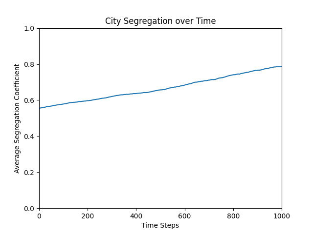

# Adding Heterogeneity to the Schelling Model
## Mira Flynn and Ben Morris, Complexity Science, Fall 2021

### 1. Abstract

With this project, we want to further investigate the Schelling model of segregation. We will recreate experiments from several papers that include Schelling's original model and an extension of varying vision distance of each cell. After investigating those models, we explore the addition of a preference for heterogeneity. In real life, people may prefer to be around a varied assortment of people. Here, we explore what threshold of percent preference for heterogeneity leads to integrated societies across various vision distances.

### 2. Schelling’s Model

Schelling’s original model centered on a grid of squares, representing some city. Each square would either be red, blue, or empty. The inhabitants of the grid are “happy” if the percent of the houses in their Moore neighborhood (the eight surrounding cells) that share a color with them is above a certain threshold.

Figure 2.1: The center square is happy, as the surrounding cells are more than 37.5% red.

Figure 2.2: The center square is unhappy, as the surrounding cells are less than 37.5% red.

Figure 2.3: The center square is happy, as although there are only two red squares, more than 37.5% of the surrounding *occupied* cells are red.

Figure 2.4: The center square is unhappy, as less than 37.5% of the surrounding occupied cells are red.

Each time step, Schelling selects an unhappy square at random and moves it to an empty cell, and runs this simulation with a few thousand updates. Schelling shows that even with relatively low thresholds, segregation occurs in a society, as shown in Figure 2.5, below.

Figure 2.5: An example city generated with Schelling’s original model. As time progresses, the city becomes more segregated

To track the movement towards segregation, we calculate, for each cell, the percentage of occupied houses they can see which share a color with them. The segregation coefficient for the entire city is the average of all of these. Plotting this coefficient over time gives a graph like that in Figure 2.6.

Figure 2.6: The average segregation coefficient over time. The flat section at the end shows the equilibrium position when all cells are happy, somewhere around 75%.

### 3. Variable Radius

In the variable radius model, the only thing that changes is the kernel - each cell’s effective vision. The variable radius model assumes any cell is a neighbor if the Manhattan distance from the center cell to the cell in question is less than or equal to the radius. Figure 3.1 shows the Moore kernel from the original model and kernels for each radius value we tested:

Figure 3.1: The Moore kernel and various von Neumann kernels

Here is an image of the graph created using the vision radius model, which measures the final segregation level versus vision radius and preference threshold:

Figure 3.2: Equilibrium segregation coefficient across various visions and thresholds

### 4. Looking Forward

If we find that the segregation model with heterogeneity is qualitatively different from the Schelling model or the variable radius model, we can explore how it is different by experimenting with different parameters. For example, if we find that the heterogeneity model leads to a higher amount of segregation than the base model for a given vision radius and happiness threshold, then we know that there is an interesting behavior to explore there. Because we have 3 input variables and 1 output variable for the heterogeneity model, interpreting the data will require several graphs to be made. Additionally, we know from the paper that the vision model exhibits interesting behavior with preference and radius thresholds. We would not be surprised if the heterogeneity model also has behaviors that aren’t easily described with a simple equation.

One potential cause for concern is if we don't find any significant patterns with our extension. While it might be a valid result, that's not a very interesting conclusion. If we encounter this, we will decide whether we have time to look at another expansion.

So far, we have implemented the base Schelling model and the vision expansion outlined in the 2003 paper. We optimized the model and implemented multiprocessing because we didn’t want to wait as long for results, and because doing so let us increase the number of simulations being run. We have also implemented heterogeneity into the model, although we need to do more testing on the implementation and we do not have final results simulated yet. Working asynchronously and checking in about the project has been working well so far, so we will continue to work in this way.

### Appendix A: Annotated Bibliography

[Models of Segregation](https://www.jstor.org/stable/pdf/1823701.pdf)

Thomas C. Schelling (1969)

Schelling introduces a new type of segregation model consisting of two types of cells (not including empty cells). Each cell prefers to have more than half of its neighbors of the same type, and will move to an empty cell if the empty cell fits its preferences. This model has cells with only minor preferences, but produces very high segregation nonetheless. The only stable states are ones with high segregation. This new model offers an explanation for how segregation occurs by setting up several reasonable rules and showing a behavior that is prevalent in the real world.

[Role of 'Vision' in Neighbourhood Racial Segregation: A Variant of the Schelling Segregation Model](http://citeseerx.ist.psu.edu/viewdoc/download?doi=10.1.1.1027.3357&rep=rep1&type=pdf)

Alexander J. Laurie, Narendra K. Jaggi (2003) 

Laurie and Jaggi extend the Schelling Segregation Model by adding an extra parameter R - the vision, or the range houses each agent looks at when determining whether to move. They find that contrary to the original Schelling model, certain values of R produce stable, integrated societies. They use a metric to measure total segregation and, through many simulations, find that certain values of R and p (percent of people each agent would like to be the same in their neighborhood) actually lowers this metric compared to Schelling’s original report. This serves as both an explanation and a design – it explains how integrated societies could exist, and provides some ideas (none fully fleshed out, but still gives some) on how we can get closer to this type of society in practice.

