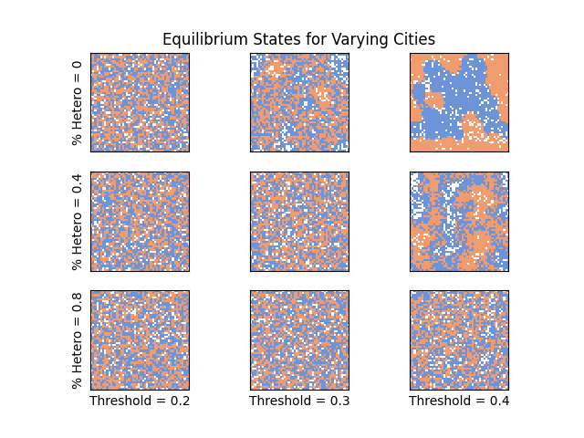
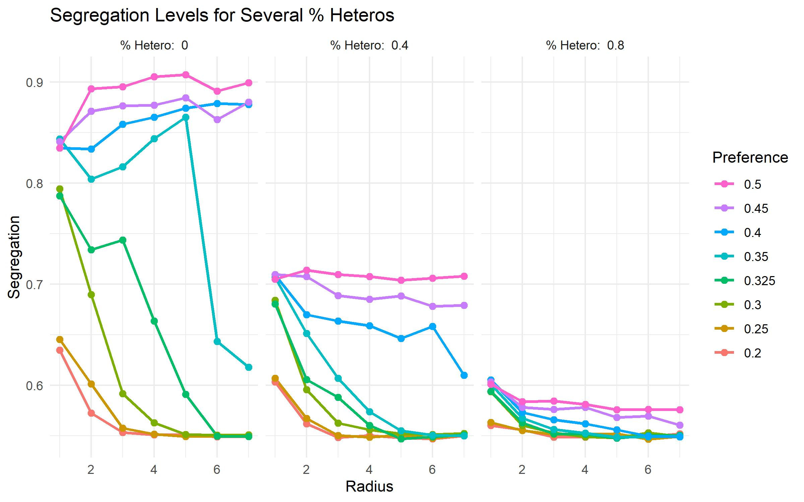
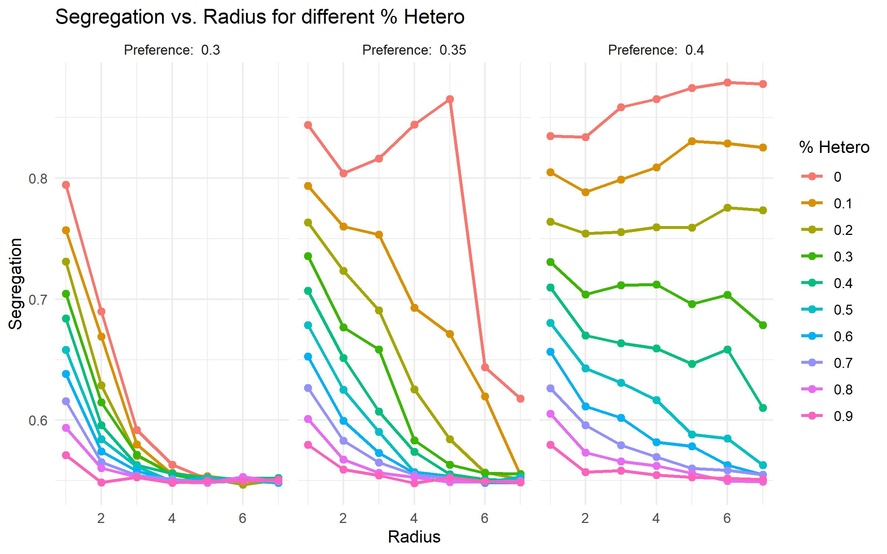

# Adding Heterogeneity to the Schelling Model
## Mira Flynn and Ben Morris

[Colab Notebook with our project code](https://colab.research.google.com/drive/1lrm4qpaeLpzPvSNegHmNPQLhv9xMmGWO?usp=sharing)

### 1. Abstract

With this project, we want to further investigate the Schelling model of segregation. We recreate experiments from several papers that include Schelling's original model and papers including an extension of the model, varying vision distance of each cell. After investigating those models, we further extend Schelling’s model by exploring the addition of a preference for heterogeneity. In real life, people may prefer to be around a varied assortment of people. Here, we explore what threshold of percent preference for heterogeneity leads to integrated societies across various vision distances.

### 2. Schelling’s Model

Schelling’s original model centered on a grid of squares, representing some city. Each square would either be red, blue, or empty. The inhabitants of the grid are “happy” if the percent of the houses in their Moore neighborhood (the eight surrounding cells) that share a color with them is above a certain threshold.

*Figure 2.1: In the left graphs, the middle cell is happy, as the surrounding cells are more than 37.5% red. In the right graphs, the middle cell is unhappy, since less than 37.5% of surrounding cells are red. Empty squares, as in the bottom row, are not counted.*

Each time step, Schelling selects an unhappy square at random and moves it to an empty cell, and runs this simulation with a few thousand updates. Schelling shows that even with low preference thresholds, segregation occurs in a society, as shown in Figure 2.2, below.

*Figure 2.2: An example city generated with Schelling’s original model. As time progresses, the city becomes more segregated.*

To track the movement towards segregation, we calculate, for each cell, the percentage of occupied houses they can see which share a color with them. The segregation coefficient for the entire city is the average of all of these. Plotting this coefficient over time gives a graph like that in Figure 2.3.

*Figure 2.3: The average segregation coefficient over time. The flat section at the end shows the equilibrium position when all cells are happy, somewhere around 75%.*

### 3. Variable Radius

In the variable radius model, the only thing that changes is the kernel - each cell’s effective vision. The variable radius model assumes any cell is a neighbor if the Manhattan distance from the center cell to the cell in question is less than or equal to the radius. Figure 3.1 shows the Moore kernel from the original model and kernels for each radius value we tested:

*Figure 3.1: The Moore kernel and various von Neumann kernels.*

Here is an image of the graph created using the vision radius model, which measures the final segregation level versus vision radius and preference threshold:

*Figure 3.2: Equilibrium segregation coefficient across various visions and thresholds.*

We decided to use the variable radius kernel to calculate segregation, as opposed to using the same kernel no matter what R value the simulation is being run with. This gives us our segregation coefficient as the cells themselves see. In real life, we view segregation through our own vision radius of sorts. Different groupings of people will see segregation at different scales. For example, in some parts of New York City, you can see segregation between groups on two different sides of a street, while segregation occurs at a much larger scale in other areas. Therefore, we felt that segregation should be defined relative to the model’s vision radius, rather than kept static for all models.

This wide range of values for each preference threshold can be seen qualitatively in Figure 3.3. As the threshold increases, the size of the single-colored blobs - segregated neighborhoods - also tends to increase. And, as radius increases, the segregation becomes more extreme; integrated cities become more integrated and segregated cities become more segregated. 

*Figure 3.3: Equilibrium cities for varying vision radii and segregation thresholds.*

### 4. Heterogeneity

To further extend this model, we added a preference heterogeneity to this model. In real life, it might not be the case that people would be happy if everyone around them was the same as them. Instead, some may prefer a mixture of different types of people. Whether or not this assumption is adhered to has the potential to have huge impacts on the results of the model. In the original Schelling paper, and in the vision extension paper, agents always prefer more of their same type, so while the extent of segregation may be surprising, segregation itself is not necessarily surprising. If instead some agents preferred to be around a mixture of people, the anticipated results are a bit harder to determine. Here, we delve into cities that contain agents with a preference for both homogeneity and heterogeneity, and explore when, if ever, this may produce more integrated cities than in the previous models.

When the city is created, the same rules are mostly kept; each square either represents an empty house, a blue house, or a red house. However, each agent is also randomly chosen to have a preference for homogeneity or heterogeneity, which stays with them as they move. The proportion of agents with a heterogenous preference is an extra parameter of the model. An agent is unhappy if:

- It has a preference for homogeneity and the percent same is less than the given threshold OR

- It has a preference for heterogeneity and the percent same is less than half the given threshold or the percent difference is less than half the given threshold

    - Half the threshold is used here so that the valid domain for the threshold remains between 0 and 1. If the threshold was not halved, all agents with a heterogenous preference would always be unhappy as soon as the threshold was more than 0.5.

Some example equilibrium cities are shown in Figure 4.1, below. As the threshold increases, the cities still tend to become more segregated, even though this threshold is also pushing those with a heterogenous preference to want integration more. Additionally, having more agents with a preference for heterogeneity creates more integrated cities. 

*Figure 4.1: Equilibrium city states for a collection of cities, varying in percent heterogeneity and preference threshold. For all cities, the vision radius is 4.*

There also seems to be a certain range of values which produce cities with both integrated and segregated sections. This seems to appear with a middling amount of heterogeneous agents and higher thresholds, as with 40% heterogenous and a threshold of 40% as in Figure 4.1.

In Figure 4.2, we can see segregation coefficients for several combinations of variables. The leftmost facet contains identical data to figure 3.2, while the other two facets show nonzero probabilities of preferring heterogeneous neighbors.

*Figure 4.2: Equilibrium segregation coefficients across various radii, preference thresholds, and percent heterogeneous values*

Figure 4.2 shows us that at these three heterogeneity probabilities, the threshold behaviors remain but are scaled down. At 40% of cells preferring heterogeneity, the lines are roughly the same shape, but shrunk towards a segregation of 0.5. At 80%, the data becomes even more clustered, and the only notable difference in behavior is that none of the lines go above their values for R=1. Together, this indicates that adding cells that prefer heterogeneity decreases overall segregation but does not add any other critical points.

*Figure 4.3: Equilibrium segregation coefficients across various radii, percent heterogeneous values, and preference thresholds*

Figure 4.3 shows us that at these 3 preference thresholds, the heterogeneous preference probabilities scale down the segregation coefficient and mask critical thresholds behavior. At a preference of 0.3, the segregation coefficients start lower for higher heterogeneity probabilities and approach about 0.5. At a preference of 0.35, the segregation coefficients also start lower for higher heterogeneity preference probabilities, and are smoother for higher heterogeneity preference probabilities. At 0% heterogeneous preference, we see the line going up and down several times, but that behavior becomes less and less noticeable as the probability of preferring heterogeneity increases. At a preference of 0.4, the probabilities of preferring heterogeneity above 0.3 trend slightly downward, while the lower probabilities trend slightly upward. Again, higher probabilities of preferring heterogeneity bring the lines closer to 0.5.

Overall, from these two graphs, we can see that heterogeneity doesn’t add any new critical points and obscures existing critical points. It seems to have the effect that we’d expect- if more cells prefer heterogeneity, then overall segregation coefficients are lower. 

### Appendix A: Annotated Bibliography

[Models of Segregation](https://www.jstor.org/stable/pdf/1823701.pdf)

Thomas C. Schelling (1969)

Schelling introduces a new type of segregation model consisting of two types of cells (not including empty cells). Each cell prefers to have more than half of its neighbors of the same type, and will move to an empty cell if the empty cell fits its preferences. This model has cells with only minor preferences, but produces very high segregation nonetheless. The only stable states are ones with high segregation. This new model offers an explanation for how segregation occurs by setting up several reasonable rules and showing a behavior that is prevalent in the real world.

[Role of 'Vision' in Neighbourhood Racial Segregation: A Variant of the Schelling Segregation Model](http://citeseerx.ist.psu.edu/viewdoc/download?doi=10.1.1.1027.3357&rep=rep1&type=pdf)

Alexander J. Laurie, Narendra K. Jaggi (2003) 

Laurie and Jaggi extend the Schelling Segregation Model by adding an extra parameter R - the vision, or the range houses each agent looks at when determining whether to move. They find that contrary to the original Schelling model, certain values of R produce stable, integrated societies. They use a metric to measure total segregation and, through many simulations, find that certain values of R and p (percent of people each agent would like to be the same in their neighborhood) actually lowers this metric compared to Schelling’s original report. This serves as both an explanation and a design – it explains how integrated societies could exist, and provides some ideas (none fully fleshed out, but still gives some) on how we can get closer to this type of society in practice.
