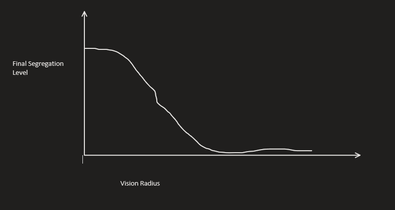
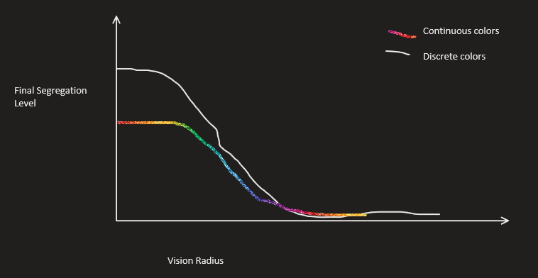

# Extending the Schelling Model into a Continuous Space
## Mira Flynn and Ben Morris, Complexity Science Fall 2021

With this project, we want to further investigate the Schelling model of segregation. We will recreate experiments from several papers that include Schelling's original model and an extension of varying vision distance of each cell. After investigating those models, we want to explore cell colors in a continuous space between the two extreme values. In real life, segregation can occur across continuous values, such as political ideology. Exploring whether these continuous values have a significant effect on the model can tell us more about the nature of segregation. We plan on using Python as our main tool, likely utilizing some common packages such as NumPy.

Here are some sketches of what we expect our outputs to look like:

If we find that the segregation model with continuous colors is significantly different than the Schelling model or the variable radius model, we can say that adding continuous colors is a significant factor in the difference.

One potential cause for concern is if we don't find any significant patterns with our extension. While it might be a valid result, that's not a very interesting conclusion. In a case like this, we may decide to work on a different expansion rather than continue to investigate behaviors with continuous values.

To get started on this project, both of us will start out by working on implementing the original Schelling model. This is the basis for each other experiment, so this must be completed first. We will then move on to implementing variable vision. We plan to both work on the same parts of the code asynchronously as the model is reasonably straightforward and does not have many disparate components.

### Annotated Bibliography

[Models of Segregation](https://www.jstor.org/stable/pdf/1823701.pdf)

Thomas C. Schelling (1969)

Schelling introduces a new type of segregation model consisting of two types of cells (not including empty cells). Each cell prefers to have more than half of its neighbors of the same type, and will move to an empty cell if the empty cell fits its preferences. This model has cells with only minor preferences, but produces very high segregation nonetheless. The only stable states are ones with high segregation. This new model offers an explanation for how segregation occurs by setting up several reasonable rules and showing a behavior that is prevalent in the real world.

[Role of 'Vision' in Neighbourhood Racial Segregation: A Variant of the Schelling Segregation Model](http://citeseerx.ist.psu.edu/viewdoc/download?doi=10.1.1.1027.3357&rep=rep1&type=pdf)

Alexander J. Laurie, Narendra K. Jaggi (2003) 

Laurie and Jaggi extend the Schelling Segregation Model by adding an extra parameter R - the vision, or the range houses each agent looks at when determining whether to move. They find that contrary to the original Schelling model, certain values of R produce stable, integrated societies. The use a metric to measure total segregation and, through many simulations, find that certain values of R and p (percent of people each agent would like to be the same in their neighborhood) actually lowers this metric compared to Schelling’s original report. This serves as both an explanation and a design – it explains how integrated societies could exist, and provides some ideas (none fully fleshed out, but still gives some) on how to create we can get closer to this type of society in practice. 